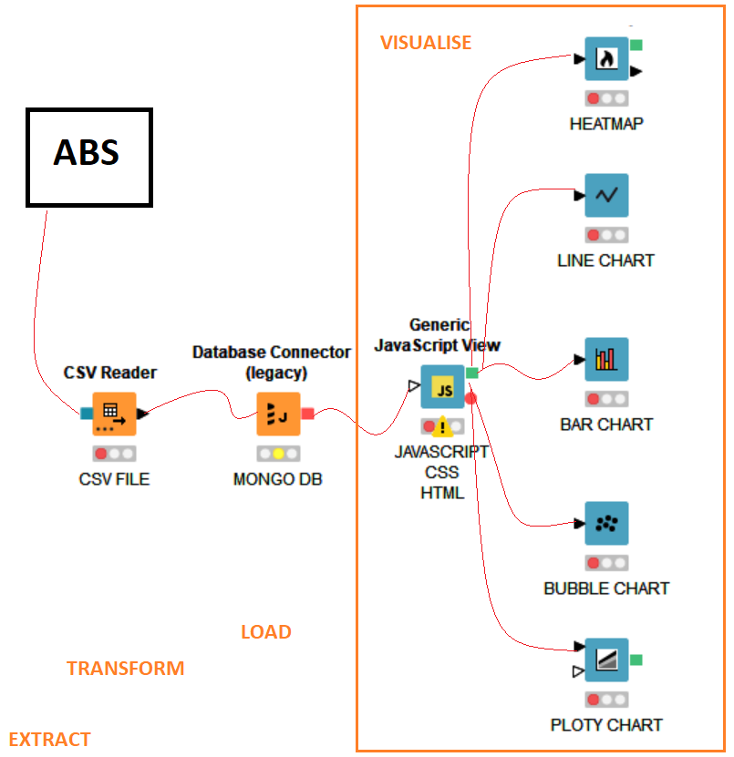

# Project 3 no wait 2 or maybe it's 3!

## About this project:
Apart from random project name because we are confused as to which Group project we are on (dont worry! it has nothing to do with our current dataset we are going to pulled... this Project basically about...... :bowtie: Owning Vehicle in Straya! :koala: :car:)

As an avid motorist and atypical professional questioner that like to ask "why? How? When? Who? What?" :innocent: we came across the dataset from ABS for personal income in Australia within certain period of time. From there, we want to compare the number of motor vehicle registration, average age used (vehicle) by state, particular motor vehicle brand by each state in Australia, and in addition we also take consideration by the population for each state.. since you know not all state in Australia is as popular as NSW #TEAMNSW :heartpulse: Little that we know, from random thought came to our mind, this project came along and now you can see the result in this page. We hope the readers find this as amusing as us :boom:

Data is derived from the Australian Bureau Statistics dataset in order to illustrate the relationship between owning the motor vechicles and your average personal Income within the state. On the side notes, you can also see the data spans between January 2016 and 31 December 2021.

## **Project Parts:**
(1) Background Images: \
\
(2) Content:\
(2a) index.html\
\
(2b) assets/css/d3Style.css\
(2c) assets/css/style.css\
\
(2d) assets/data/data.csv\
\
(2e) assets/js/.eslintrc.json\
(2f) assets/js/app.js

## Approach
1. Identify data sources and dependencies
2. Collect and clean trajectory data
3. Join 6 datasets on personal income, total volume of motor vehicle registration by state, motor vehicle's age by state, total volume of motor vehicle registration by brand, Population by state, Size by state in comparison to whole Australia.
4. Load data in MongoDB
5. Create Flask App and connect routes to MongoDB local host
6. Create charts and map using Javascript libraries
7. Customise html for final application
8. Visualise dashboard locally or in Heroku

## **Architectural Diagram:**

## **Data Sources:**
Data is derived from the ABS. Data spans 1 January 2018 and 29 January 2020.
- [ABS employee earnings](https://www.abs.gov.au/statistics/labour/earnings-and-working-conditions/employee-earnings-and-hours-australia/may-2021#data-download)
- [ABS motor vehicles census](https://www.abs.gov.au/statistics/industry/tourism-and-transport/motor-vehicle-census-australia/31-jan-2021#data-download)

## **Project Charter:**
(1) Display script from repository\
\
(2) Display website 

## **Coding Languages:**

## **Data Bases:**

## **Platform:**

## **IDE:**

## Limitations, Assumptions & Challenges
- Limited time of project

## **Observations:**
Lorem Ipsum

## **Website Design:**
This application includes 3 responsive webpages with dynamic navigation built using HTML, CSS, and using bootstrap .

## **Project Authors:**
Authors:

Vik Shah - https://github.com/viktiger

Ash Tao - https://github.com/Ash-Tao

Patty - https://github.com/PBx0N

Tu Cam - https://github.com/tucamdang

Rosa - https://github.com/oshabu

  

